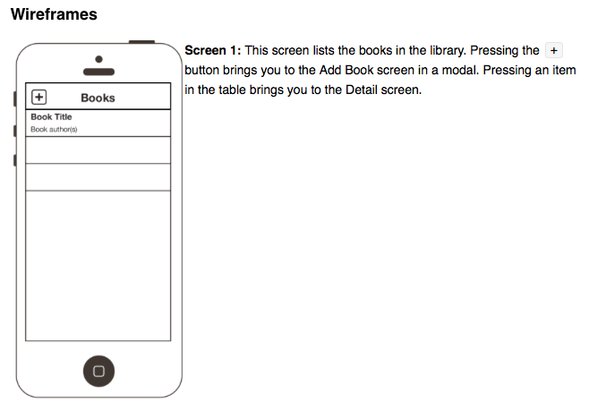
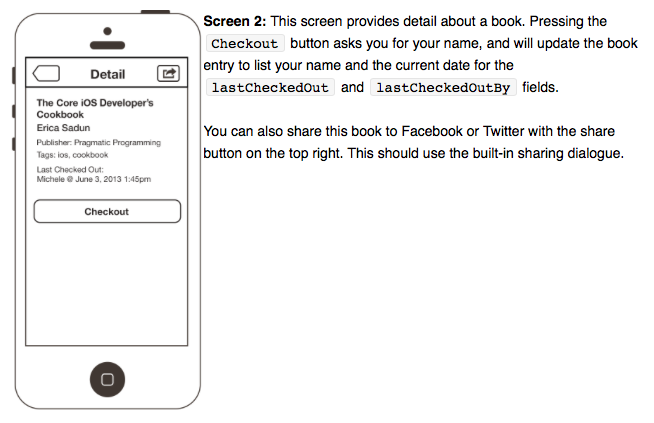
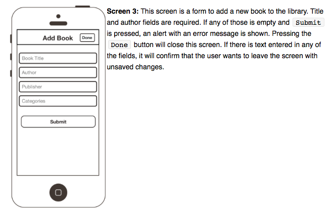

# the-prolific-library

The Prolific Library
The SWAG committee is looking for a way to track who has which book from our library. The goal of this exercise is to create a simple app that connects to a web server and performs a GET, a POST, and a PUT. You may use any 3rd party libraries and tools that you'd like.

# Requirements

- The app should utilize both Objective-C and Swift 2.0 code (please do not use any previous versions of Swift). The majority of the codebase should be written in Swift.
- The app should be iPhone 4+ compatible and use Auto Layout.
- The app should run on iOS 8+.
- You should include a README, that contains at least some implementation details (architecture, technical decisions explanation, etc.)
- You should create a private git repo and invite your interviewer to it once created so we can better keep track of your progress. Bitbucket is preferred, but you can use the service/host of your choice.

